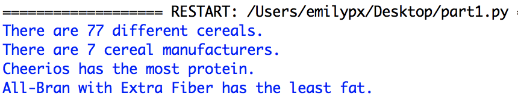
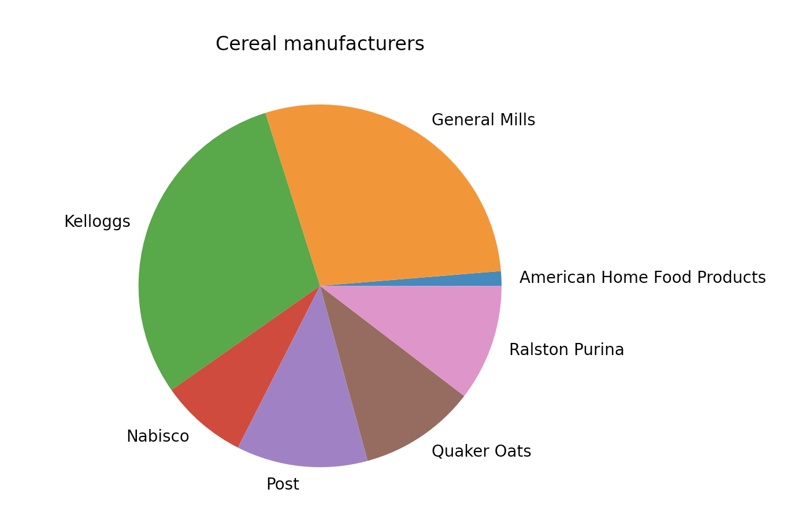
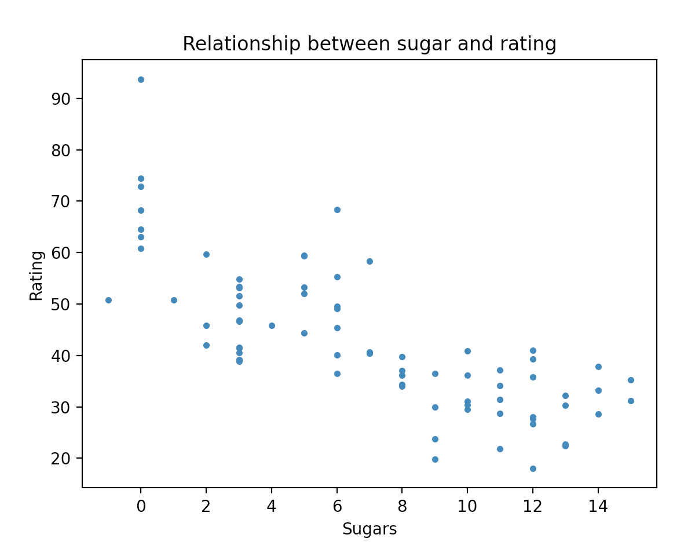
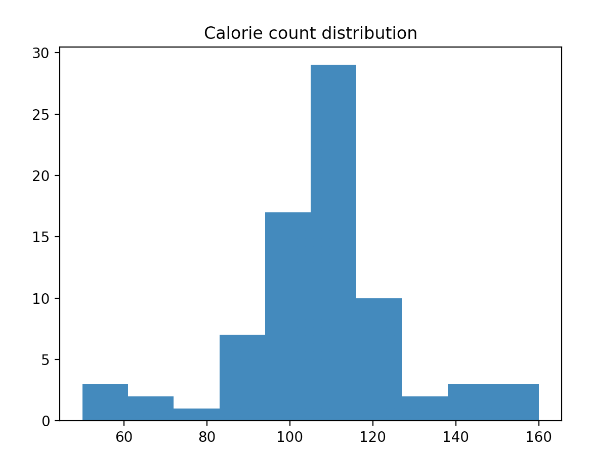
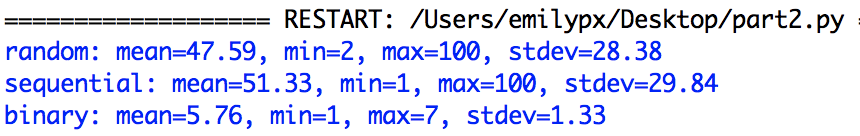
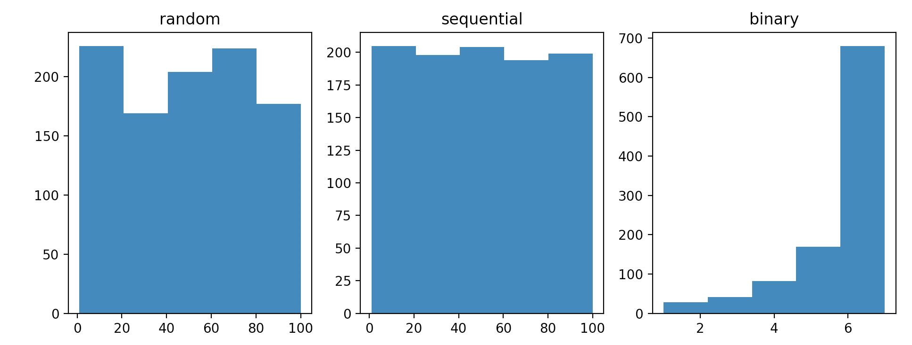

# Problem Set 8

### Due Tuesday, November 8, 2022, at 11:59pm EST (bye-bye daylight savings)

As always, you will submit to Canvas **a single .zip file**. Detailed instructions for what the .zip file should contain are at the end of this problem set. 

**Structure:** Your programs should follow the structure indicated in the program description.

**Comments:** I now expect you to write comments in your code! Two points will be deducted if you provide no or minimal comments, and 1 point will be deducted if you have sufficient comments but they do not conform to the requirements outlined in PS4.

**Valid code:** I expect you to submit code that runs to completion with no errors. (By "error", I mean either red text in the IDLE window containing the word Error, or warning messages associated with a pink cursor in your code window that prevent you from running your program at all.) Programs or functions that produce errors when we run them will receive a grade of 0. If you cannot get your code to run without errors, you should either post to Slack the exact error and a screenshot of the snippet of code causing the error, or come to office hours so that we can help you fix it. If it's too late to get help (e.g., late in the day it's due), comment out code until your program runs without errors, and indicate in the comments where and why you commented out that code. Programs with partial code will receive partial credit.

**Folders:** Download this whole folder to your desktop, unzip it, and write all of your programs in that folder. Don't download the folder over and over again. Once is enough! Remember to keep everything in the same folder. Do not move files in and out of this folder. Do not keep any folders for this class in Downloads, as this may prevent you from reading from and writing to files.

**Honor pledge**: And, as always, in every program, the first four lines (comments) should be your honor pledge.

**Libraries**: Before gettings started make sure you have the following libraries installed. Don't remember how to install libraries? See the instructions from PS7 and from the lecture notes for 11/1.

* NumPy
* Matplotlib
* Pandas

## Part 1: Cereal data
Open `part1.py`. The comments in this file will tell you what you need to do using the libraries NumPy, Pandas, and Matplotlib. 

The dataset you'll be using is in the file called `cereal.csv`. You can read more about it [here](https://www.kaggle.com/crawford/80-cereals).

Helpful hints:

* See the sample code from this week for commented examples showing how to do most or all of these things. 
* Also, please look at the links I have provided in the readings for this week.
* Try doing everything on the IDLE shell at first so you don't have to keep loading the file. Then once you have figured it out, paste the commands into your `part1.py` file, and run the program to make sure it works.

Here is what my output looks like, along with the plots I created.

## Part 2: Number guessing
In `part2.py`, **I have provided the code** for guessing a number between 1 and 100 using the three techniques we have discussed and coded up ourselves, with one function for each of the three techniques. Eacn function takes the number to be guessed as an argument and then returns the number of guesses required to guess that number correctly using the specified technique. The three techniques are:

* start guessing at 1 and add 1 until you guess the right number (**sequential**)
* guess random numbers, never guessing the same number twice, until you guess the right number (**random**)
* binary search (**binary**)

You will write a function, `simulateguessing(technique)` whose argumment, `technique` is a string that is either "sequential", "random", or "binary". This function will have a loop that generates a random number between 1 and 100 and then calls the guessing function corresponding to the technique specified by the argument 1000 times. It will save each number it gets back from the guessing function into a list, so that at the end of the loop, it will have a list that is 1000 elements long containing the number of guesses required for each random number it generated. It will return that list.

Finally in your `main()` function, you will do the following:

* Call `simulateguessing()` with each of the three possible values ("sequential", "random", or "binary"). Don't forget that these functions returns a list, which you need to save to a variable, of course!
* Using `numpy`, calculate the mean, min, max, and standard deviation for the result of each call to `simulateguessing()`, and print them out as shown in the sample output, below. ([See the readings about numpy here for some help](https://github.com/CSC1-1101-TTh9-S21/numpy-reading).)
* Using `matplotlib`, create a plot with three subplots, where each subplot contains a histogram for one of the three lists you got back from `simluateguessing()`. 

Here is some sample output, and the subplots that I got.

---

## What to submit

Zip up the directory, including all the original components and your completed `part1.py` and `part2.py` programs. Submit this `.zip` file to Canvas.

### Due Tuesday, November 8, 2022 at 11:59pm EST

